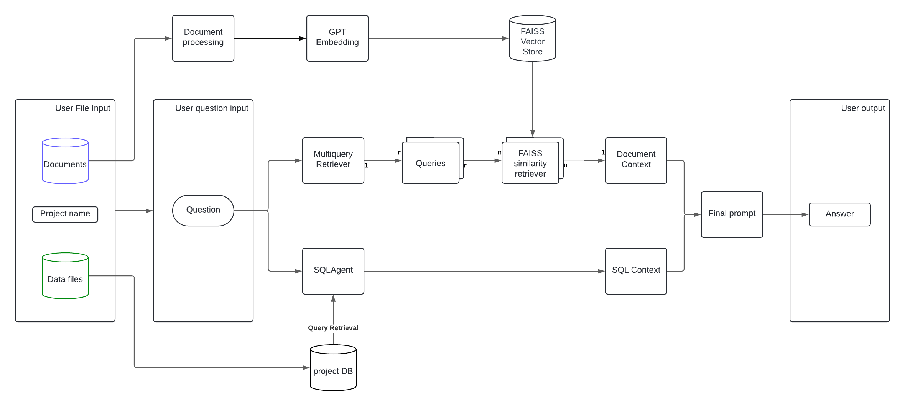

# ClientIQ Chatbot


## Overview

ClientIQ is a pioneering chatbot designed for businesses to manage and understand vast amounts of client-specific information effortlessly. By leveraging both structured data from SQL databases and unstructured data from various documents, ClientIQ provides comprehensive answers to complex business queries, streamlining decision-making and enhancing operational efficiency.

## Business Value

- **Client Insight**: Delve deep into each client's data, offering a centralized platform for informed decision-making.
- **Efficiency**: Saves time and resources by automating the retrieval and synthesis of client information.


## Targeted Problems

ClientIQ addresses key challenges in client data management, including:
- The difficulty of maintaining up-to-date knowledge across all team members.
- The inefficiency of accessing and synthesizing data from disparate sources.

## Features

- **Data Integration**: Combines information from SQL databases and document stores seamlessly.
- **Document Processing**: Processes uploaded documents automatically to extract and index text.
- **Dynamic Data Handling**: Allows for the upload of data tables and documents for query relevance.
- **Intelligent Query Handling**: Employs advanced NLP to interpret and respond to inquiries effectively.

## Supported File Formats

ClientIQ is designed to process and integrate a variety of file formats to ensure comprehensive data analysis and query response. Currently, the supported file formats include:

- **Documents**: DOCX and PDF for unstructured data extraction.
- **Data Tables**: Excel (XLSX) and CSV files for structured data analysis.

We plan to expand this list in the future to accommodate more file types, further enhancing the chatbot's versatility and its ability to provide detailed and accurate answers from diverse data sources.

## Ideal For

Businesses seeking to enhance their client management processes, where understanding client-specific data and cross-team knowledge is crucial for personalized service delivery .


## Project Structure

- `app.py`: The main Streamlit application script that provides the UI for project initialization, file uploads, and interacting with the chatbot.
- `chatbot/`: Contains the `ClientIQ` chatbot logic, integrating SQL data retrieval, document retrieval, and response generation.
  - `chatbot.py`: Defines the `ClientIQ` class, incorporating LangChain components to process user queries.
- `utilities/`: Utility scripts for database and document management.
  - `db_manager.py`: Manages database operations, including table data loading into an SQLite database.
  - `document_processor.py`: Handles the extraction and indexing of text from uploaded documents.
  
## Installation

1. Clone the repository to your local machine.
2. Ensure you have Python 3.x installed.
3. Install the required dependencies:
   ```bash
   pip install -r requirements.txt
   ```
4. Run the Streamlit app:
   ```bash
   streamlit run app.py
   ```

## Usage

1. Start the Streamlit application as mentioned in the Installation section.
2. Enter a project name to initialize a new session.
3. Upload the data tables and documents relevant to your queries.
4. Click on "Initialize Chatbot" after uploading your files.
5. Use the chat interface to ask questions and receive answers based on the uploaded data.

### Overview of `ClientIQ` Logic Within LangChain Framework

The `ClientIQ` chatbot is an advanced implementation that combines structured SQL database queries with unstructured document retrieval to generate comprehensive answers. It leverages LangChain—a framework for building applications with large language models (LLMs)—to orchestrate interactions between different data sources and the LLM.

### The Core Components

1. **Language Model (LLM)**: Utilizes `ChatOpenAI` from LangChain, configured to interact with OpenAI's models (e.g., GPT-3.5-turbo). The model is the backbone for understanding queries, generating alternative queries, and synthesizing answers based on context provided from multiple sources.

2. **SQL Agent**: Employs `create_sql_agent`, which allows executing structured queries against an SQL database (SQLite in this case) and retrieving relevant structured data. This agent is crucial for incorporating precise, structured information into the chatbot's responses.

3. **Document Retriever**: Facilitated by the `FAISS` vector store and the `vectorstore.as_retriever` method, this component performs similarity-based searches across indexed documents to find content related to the user's query or the alternative queries generated by the LLM. It's key for integrating unstructured data insights.

### The Processing Chain

The `ClientIQ` chain is a sophisticated sequence of operations designed to handle a user query, fetch relevant context, and generate an informed response:

1. **Multi-Query Generation**: Initially, the user's query is processed to generate multiple alternative queries. This step uses the LLM to reinterpret the original question from various perspectives, enhancing the breadth of document retrieval by covering different angles or aspects relevant to the query.

2. **Parallel Retrieval**: The `RunnableParallel` component orchestrates concurrent retrieval operations:
    - **SQLAgent**: Executes SQL queries against the database to fetch structured data insights.
    - **MultiQueryRetriever**: Uses the alternative queries to retrieve relevant documents from the vector store, broadening the search scope beyond what traditional keyword-based methods may capture.

3. **Synthesis and Response Generation**: With structured data from the SQL agent and unstructured insights from document retrieval, a comprehensive prompt is constructed. This prompt integrates all fetched context and reiterates the original query, guiding the LLM to synthesize a detailed and reasoned response.

4. **Output Parsing**: Finally, the `StrOutputParser` parses the LLM's output, ensuring the response is formatted and presented appropriately to the user.

### Advanced Prompt Engineering

In developing ClientIQ, we employed specialized prompt techniques to enhance the chatbot's understanding and response accuracy:

1. **Multi-Query Dissection**: For comprehensive document retrieval, we crafted prompts that instruct the AI to dissect the original user query into multiple sub-queries. This approach ensures broad coverage and depth in document search, capturing varied perspectives on the user query.

2. **SQL Data Integration**: Prompts for the SQLAgent are designed to fetch relevant structured data directly related to the user query, providing a data-rich context for the final response.

3. **Synthesized Response Generation**: The final prompt consolidates insights from both the multi-query retriever and SQLAgent data, guiding the AI to craft a response that is both comprehensive and directly relevant to the original question. This method ensures the utilization of a wide range of information sources for an informed and precise answer.

### Visualizing the Logic Chain

To better understand the operational flow of ClientIQ, a graphical representation will be added here detailing the step-by-step process from query dissection through to the synthesized response generation. This visualization will encapsulate the dynamic interaction between the multi-query retriever, SQLAgent, and the final response generation, illustrating the path from query to answer.



By incorporating these prompt techniques and providing a clear graphical representation of the logic chain, we aim to offer deeper insights into the technical foundation of ClientIQ, emphasizing its capability to transform complex queries into actionable business intelligence.

### Technical Innovations

- **Multi-Perspective Query Handling**: This approach mitigates the limitations of distance-based similarity searches by generating alternative queries that capture a wider range of relevant documents, enhancing the chatbot's ability to provide nuanced and informed answers.

- **Integrated Contextual Response**: By synthesizing data from both SQL databases and unstructured documents, the chatbot offers answers that are not only contextually rich but also grounded in specific data points, setting a new standard for data-driven decision support systems.

- **Scalable and Modular Design**: The modular design, facilitated by LangChain's components, allows for easy expansion or refinement. New data sources, processing steps, or output formats can be integrated with minimal changes to the existing setup.

## Future Enhancements

The ClientIQ Chatbot is constantly evolving. Our roadmap for future enhancements includes the following:

- **Memory Implementation**: Integrate a memory module that allows the bot to remember past interactions, providing continuity across sessions and a more personalized user experience.

- **Enhanced Contextual Reasoning**: Explore the integration of Retrieval-Augmented Thought (RAT) to enable the bot to perform complex problem solving and maintain context over longer interactions.

- **Simplified Knowledge Base**: Develop a lighter version of the chatbot specifically for internal use, acting as a dynamic knowledge base to support quick information retrieval within organizations.

- **Privacy-Focused User Roles**: Implement advanced user management within the bot to ensure sensitive information is accessed only by authorized personnel, addressing data privacy concerns.

- **Feedback Loop for Continuous Improvement**: Establish mechanisms for users to provide feedback directly within the bot, facilitating continuous improvement and user-driven enhancements.

- **Language Proficiency**: Enhance the bot's natural language understanding to include recognizing and adapting to the user's language style and terminology for more natural interactions.

- **Spanish Language Support**: Expand language support starting with Spanish, to cater to a broader user base and provide services in their native language.

- **Ongoing LangChain Development**: Continue to explore the capabilities of the LangChain framework and stay abreast of new features and potential integrations that can be leveraged.

- **Modular Feature Integration**: Maintain a modular design philosophy to enable rapid adaptation and integration of new features as they become relevant and available.

- **API Endpoints for Integration**: Create API endpoints to facilitate the integration of ClientIQ with other systems and platforms, paving the way for wider usability and application.

- **Balancing Simplicity with Robustness**: Currently, ClientIQ champions ease of use, allowing users to get started by simply uploading their files. Moving forward, we aim to strike a balance between maintaining this simplicity while enhancing the bot's robustness. Plans include integrating connections to document stores like Notion and facilitating links to users' own databases. This will provide power users the flexibility they require without compromising the straightforward experience our users love.


We're committed to advancing ClientIQ's features and welcome suggestions from the community as we forge the path ahead.

### Conclusion

`ClientIQ` exemplifies a sophisticated use of the LangChain framework to build a chatbot that transcends traditional limitations by dynamically leveraging both structured and unstructured data sources. Its architecture and processing logic demonstrate a powerful approach to building AI-driven decision support and research tools.

## Contributing

We encourage contributions that improve ClientIQ’s functionality, including new features, bug fixes, and documentation enhancements. Join us in refining this innovative tool to better serve businesses in managing client data.

## License

[MIT License](LICENSE) - see the LICENSE file for details.

